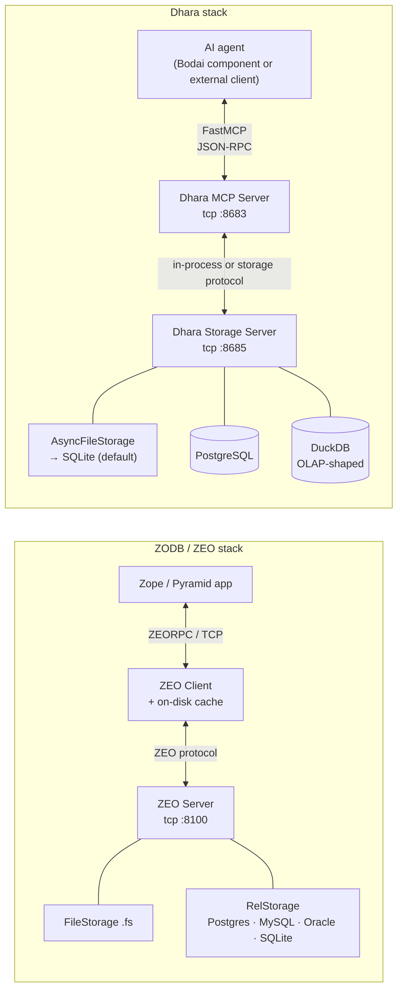

# Dhara Compared to ZODB / ZEO

This document compares Dhara with the Python ecosystem's other well-known
persistent-object database: [ZODB](https://zodb.org) and its network
storage layer, [ZEO](https://zopefoundation.github.io/ZEO/). It is the
substantive companion to the short ["Why Dhara, not ZODB/ZEO?" section
in the README](../README.md#why-dhara-not-zodbzeo).

For the Bodai-specific framing — *why this comparison lands where it does
for our use case* — read the README. This doc is the neutral feature
matrix, lineage, and process-topology diagram.

## TL;DR for the impatient

|                            | **ZODB / ZEO**                                                    | **Dhara**                                                                 |
|----------------------------|-------------------------------------------------------------------|---------------------------------------------------------------------------|
| **Origin**                 | Zope Corporation (Jim Fulton), late 1990s                          | CNRI MEMS Exchange (Durus fork), modernised into Dhara                     |
| **Maintenance (2025)**     | Maintenance mode — bug/security fixes only                         | Active — Python 3.13+, msgspec, Oneiric, MCP server                        |
| **Threading model**        | Multi-threaded server                                             | Single-threaded server (explicit design choice)                           |
| **Concurrency model**      | Optimistic — `ConflictError` + app-level `_p_resolveConflict` merge| Connection-registered single-writer per connection (server orders writes)  |
| **Large-index support**    | `BTrees.OOBTree`, `IOBTree`, etc. — the standard way               | None (relies on plain `PersistentDict`)                                   |
| **Conflict resolution**    | Yes — classes opt in to auto-merge on `ConflictError`              | No application hook                                                       |
| **Network storage layer**  | ZEO (default port `8100`)                                         | Dhara Storage Server (default port `8685`)                                 |
| **AI/agent surface**       | None (regular Python client library)                               | FastMCP server on default port `8683`                                      |
| **Storage backends**       | `FileStorage`; RelStorage on PostgreSQL/MySQL/Oracle/SQLite       | `AsyncFileStorage` → SQLite (default); PostgreSQL; DuckDB; in-memory        |
| **Serialization**          | `pickle`                                                          | `pickle`, with `msgspec` option                                            |
| **Best at**                | Long-lived CMSes, large graph indices, collaborative edit patterns | Single-process or moderately-distributed workloads; agent/control-plane use |

If that table answers your question, you don't need the rest of this doc.
If you want to know *why* any of these differences exist, read on.

## Architecture overview

The shapes look similar — both are "clients → server → backend" — but the
Dhara stack adds the FastMCP layer in front because its primary consumers
are AI agents, not just Python web apps. That extra hop is the single most
architecturally-distinct choice in Dhara's design, and it cascades into
several of the differences in the matrix below.

## Lineage and status

| Dimension          | **ZODB / ZEO**                                            | **Dhara**                                                          |
|--------------------|-----------------------------------------------------------|--------------------------------------------------------------------|
| Origin             | Zope Corporation (Jim Fulton); first releases late 1990s   | CNRI MEMS Exchange (Durus); modern continuation as Dhara           |
| Current line       | ZODB 5.7.x / 5.8.x, ZEO 5.x                                | Dhara 0.19.x (targeting 0.20; 1.0 compatibility-reduction window)   |
| Cadence            | Maintenance: small releases, security fixes, no rewrites  | Active development on Python 3.13/3.14                             |
| Ecosystem          | Zope / Plone CMS, Pyramid, long-lived internal tools      | Bodai ecosystem + standalone adoption                               |
| License            | Zope Public License (ZPL)                                 | Open-source (see `LICENSE.txt`)                                     |

Both are in the same design niche: *Python-native object database with
ACID transactions and transparent persistence*. The lineages don't share
code directly but share a design tradition — pickling Python objects to
disk, indexing them by OID, restoring them through a `Connection` that
tracks dirty state.

## Design philosophy

| Dimension                | **ZODB / ZEO**                                                            | **Dhara**                                                                |
|--------------------------|---------------------------------------------------------------------------|--------------------------------------------------------------------------|
| Threading model          | Multi-threaded server                                                     | Single-threaded server (explicit design choice)                          |
| Data model               | Graph of `persistent.Persistent` subclasses reachable from a root         | Same — graph of `dhara.core.persistent.Persistent` subclasses             |
| Built-in collections     | `PersistentMapping`, `PersistentList`, **`BTrees`** family for large indices | `PersistentDict`, `PersistentList`. No BTree layer.                       |
| Serialization            | `pickle`                                                                  | `pickle`, with `msgspec` option                                           |
| Transactions             | `transaction.begin()` / `commit()` / `abort()`; savepoints supported      | `connection.commit()` / `abort()` on the Connection                       |
| Conflict model           | Optimistic. Two clients modifying the same `Persistent` instance raise `ConflictError` on commit. Classes can opt in to merge with `_p_resolveConflict` | Single-writer per Connection. Writes serialize through the server. **No application-visible merge hook.** |

The presence (ZODB) vs. absence (Dhara) of `_p_resolveConflict` is the
single biggest philosophical difference between the two. ZODB assumes
the application can define a meaningful merge strategy for any object.
Dhara assumes operations are short enough to commit ahead of any
contention, which lets it ship a simpler model. That assumption shapes
everything downstream — Dhara's simpler conflict story is real leverage,
but it also means Dhara can't replicate ZODB's pattern for collaborative
editing the way a wiki might use it.

`★ Insight ─────────────────────────────────────`
The BTrees gap is the other big one. If you wanted to put Dhara in front
of a catalog with millions of indexed entries, you'd be doing something
ZODB's `BTrees.OOBTree` does elegantly and Dhara has no analog for. Today
Dhara's consumer (the Bodai control plane) doesn't need that scale, so
the gap is theoretical — but worth knowing before you adopt Dhara for a
catalog-style workload.
`─────────────────────────────────────────────────`

## Server and distribution layer

| Dimension             | **ZEO**                                                          | **Dhara Storage Server**                                                 |
|-----------------------|-----------------------------------------------------------------|--------------------------------------------------------------------------|
| Role                  | Network-attached storage for ZODB clients                        | Same role — `dhara db start` starts a server clients connect to          |
| Default port         | **`8100`**                                                       | **`8685`** (paired with Dhara MCP `:8683`, Bodai-canonical core slot)    |
| Protocol             | Custom binary TCP (ZEORPC); ZEO serialises ops over it           | Custom protocol over TCP or Unix domain socket                           |
| Pluggable storage    | Yes — ZEO can sit on `FileStorage` OR `RelStorage`               | Yes — SQLite / PostgreSQL / DuckDB                                       |
| Client cache         | **Persistent on-disk cache per client.** Transactionally invalidated on other clients' commits. | Persistent on-disk cache as well (smaller and less featureful)            |
| Auto-GC              | `gcinterval` argument triggers automatic packing                 | Same — `gcinterval` is supported                                         |

## Storage backends

|                          | **ZODB / ZEO**                                      | **Dhara**                                                            |
|--------------------------|-----------------------------------------------------|----------------------------------------------------------------------|
| Filesystem               | `FileStorage` (default; mature; point-in-time recovery, online ZRS replication) | `AsyncFileStorage` (path-style wrapper over `AsyncSqliteStorage`); legacy `FileStorage` |
| SQLite                   | Only as a RelStorage backend                        | **Default** — `AsyncSqliteStorage` with `sqlite+aiosqlite://` URLs   |
| PostgreSQL               | Via RelStorage                                      | First-class — `storage/postgres.py`                                  |
| DuckDB                   | Not supported by ZODB                               | **`storage/duckdb_adapter.py`** — Dhara-specific                       |
| MySQL / Oracle           | Via RelStorage                                      | Not supported                                                        |
| In-memory                | `TemporaryStorage`                                  | `storage/memory.py`                                                  |

The DuckDB backend has no analog in the ZODB world because RelStorage only
speaks relational engines. Adopting DuckDB signals an interest in
columnar / OLAP-style queries on the same store — a Bodai-shaped workload
that doesn't show up in Zope/Plone deployments.

## Modernisation: what Dhara adds on top

| Capability                    | **ZODB/ZEO**                                       | **Dhara**                                                              |
|-------------------------------|----------------------------------------------------|------------------------------------------------------------------------|
| Modern Python type hints      | Partial; ZODB itself is incompletely annotated     | Full 3.13+ hints across the codebase                                   |
| MCP server surface            | None                                               | `dhara mcp start/stop/status/health`; ~12 tool modules in `dhara/mcp/` |
| Adapter registry role         | Generic storage                                    | First-class — Oneiric adapter configs persisted here                   |
| Ecosystem events/observability | Zope ecosystem (`zope.catalog`, `zope.interface`)  | Bodai ecosystem (Mahavishnu, Akosha, Crackerjack read from it)        |
| `msgspec` serialisation       | Not available                                      | First-class option alongside `pickle`                                  |
| Async-first connection API    | `asyncpg`-shaped async support is partial          | `AsyncConnection` is a first-class peer of `Connection`                |
| Multi-threaded server         | Yes                                                | No — by design                                                        |

## Practical tradeoffs

**Where ZODB/ZEO still beats Dhara:**

- Decades of operational hardening; production-proven at Zope/Plone scale.
- `BTrees` for large indices. **This is the biggest single gap.**
- `zope.catalog`, `hypatia`, and the rest of the Zope ecosystem for full-text and faceted search.
- Conflict resolution via `_p_resolveConflict` for collaborative-edit patterns.
- Multi-threaded server with proven throughput profiles.
- `RelStorage` on MySQL/Oracle — if you need either engine, ZODB is the choice.
- Largest community and Stack Overflow corpus of any Python object database.

**Where Dhara beats ZODB/ZEO:**

- Native MCP server surface for AI agents — no Python ZODB client needed.
- `msgspec` serialisation alongside pickle (faster, with schema-aware options).
- DuckDB backend for columnar/analytical queries on the same store.
- First-class `AsyncConnection` that fits `asyncio`-first apps cleanly.
- Oneiric config integration — `dhara.core.config.DharaSettings` is layered config out of the box.
- Active development pace in 2025–2026 (ZODB is in maintenance).
- Designed to be **fully usable standalone** — outside the Bodai ecosystem, with SQLite/Postgres/DuckDB backends, in-process or networked.

## When to reach for which

Pick Dhara if any of these are true:

- Your primary consumer is an AI agent or another AI-shaped service. The MCP server surface is already in place.
- Your access pattern is read-heavy with short, infrequent writes that can serialize cleanly.
- You want to use SQLite as the primary store, or PostgreSQL with the same async API.
- You want a single small, modern Python codebase you can read in a sitting.
- You want the object store to *also* be the Oneiric adapter registry for the Bodai control plane.

Pick ZODB/ZEO if any of these are true:

- You need BTree-backed indexes for millions of entries.
- You need application-level conflict resolution across simultaneous writers.
- You're building on top of Zope/Plone and want to stay in one ecosystem.
- You need multi-threaded server throughput.
- You need MySQL or Oracle as your backing store (RelStorage only).

If neither column reads cleanly, **your choice probably comes down to BTrees
or MCP**. Those are the two axes ZODB and Dhara don't trade off against
each other on.

## Acknowledgements

Dhara is a modern continuation of **Durus**, originally developed by the
MEMS Exchange software development team at the Corporation for National
Research Initiatives (CNRI). The Dhara authors are grateful for the
foundational work done by the original Durus developers.
