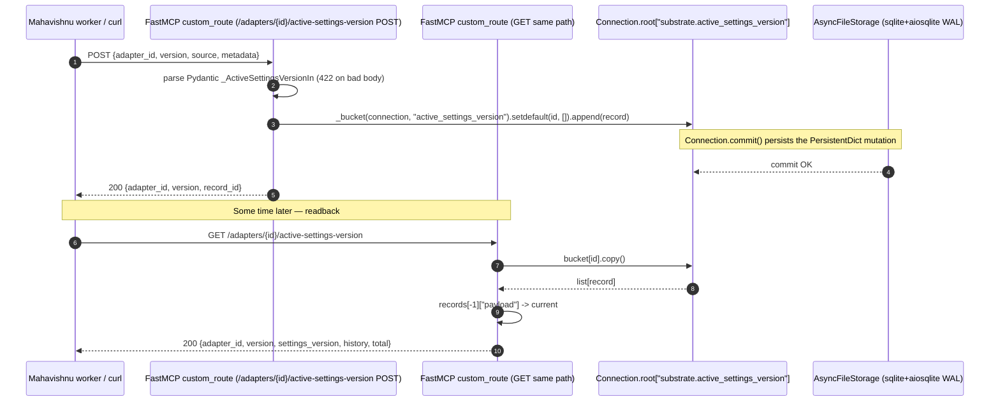

# Dhara Memory Architecture

> **Status**: Living document. Updated whenever the storage schema, MCP surface, or integration contracts change.
> **Audience**: Bodai ecosystem contributors, Claude Code users, and downstream components (Mahavishnu, Akosha, Session-Buddy, Crackerjack).
> **Source of truth**: The persistent object graph in `dhara/storage/`, `dhara/core/connection.py`, the `PersistentDict` root in `dhara/mcp/kv_timeseries.py` / `dhara/mcp/ecosystem_state.py` / `dhara/mcp/adapter_tools.py`, the substrate HTTP routes in `dhara/mcp/substrate_routes.py`, and the SQL DDL in `dhara/migrations/sql/`.

Dhara is the **Curator / state** component of the Bodai ecosystem. It
owns a Durus-style persistent object graph (BTree-keyed by OID, backed
by SQLite/aiosqlite or PostgreSQL via asyncpg), an ACID transaction
layer over that graph (`Connection.begin/commit/abort`), and the
canonical substrate for the rest of the ecosystem: a key/value store
with TTL, an append-mostly time-series store, a per-component service
registry, an event log, a Oneiric adapter distribution catalog, and
three Workstream C/D substrate resources (active-settings-version,
context-versions, progress-snapshots). It is the only Bodai component
that exposes both an MCP tool surface (`mcp__dhara__*`) and a
REST-style HTTP substrate (`/adapters/{id}/active-settings-version`,
`/tenants/{id}/context-versions`, `/workflows/{id}/progress-snapshots`,
`/tools/call`).

This document describes what Dhara stores, who reads and writes it,
and the integration contracts the rest of the ecosystem depends on.
The four contract bugs captured below were the trigger for writing it
— they all stemmed from undocumented expectations about how the
persistent object store, the substrate routes, the REST `/tools/call`
endpoint, and the tool profile gating line up.

______________________________________________________________________

## Table of Contents

1. [Storage Inventory](#1-storage-inventory)
1. [MCP Write Surface](#2-mcp-write-surface)
1. [MCP Read Surface](#3-mcp-read-surface)
1. [Cross-Component Visibility](#4-cross-component-visibility)
1. [Integration Contract](#5-integration-contract)
1. [Sample Queries](#6-sample-queries)
1. [Diagrams](#7-diagrams)
1. [Operational Notes](#8-operational-notes)

______________________________________________________________________

## 1. Storage Inventory

Dhara persists state in **one persistent object graph** rooted at
`Connection.root` (a `PersistentDict`). Eight top-level keys hang off
that root; each is its own logical store. All cross-bucket joins go
through `connection.get_root()` — that is the single anchor point that
downstream components MUST reference. The serialization byte format is
Durus's `pack_record` envelope (see `dhara/serialize/record.py`); the
on-disk engine is SQLite (via `aiosqlite`) or PostgreSQL (via
`asyncpg`).

| Bucket | Root key | Introduced | Owner / Purpose |
|--------|----------|------------|-----------------|
| **KV store** | `kv` (+ `kv_ttl` for expiry timestamps) | v3.0 (KV/TimeSeries refactor) | Per-key persistent dict + per-key epoch expiry; used by `put`, `get`, `list_prefix`, and by `component_endpoint/*` registrations from other components. |
| **Time-series store** | `time_series` | v3.0 | Per-`metric_type:entity_id` `PersistentList` of `{ts, ...payload}` records; pruned by `_purge_ts` against `TimeSeriesRetention(retention_days=60)` (default). |
| **Ecosystem services** | `ecosystem_services` | v3.0 | `PersistentDict[service_id -> ServiceRecord]` with `capabilities`, `metadata`, `lease_expires_at`, `heartbeat_at`. Phase-0 component discovery source. |
| **Ecosystem events** | `ecosystem_events` | v3.0 | Append-mostly `PersistentList` of `EventRecord` (schema_version=1); pruned by `EventRetention(retention_days=30)` (default). |
| **Adapter registry** | `adapters` (+ `health_checks`) | v4.0 | One `Adapter` persistent object per `domain:key:provider`; on every `store_adapter`, the previous version's snapshot is appended to `adapter.version_history`. `health_checks[adapter_id]` is a per-adapter health ledger. |
| **Substrate** (inline dict-of-lists) | `substrate.active_settings_version`, `substrate.context_versions`, `substrate.progress_snapshots` | v5.0 (Workstream C) | Three buckets of per-resource append-only records; the Workstream D TODO will swap these for SQL-backed tables from migration `0001_initial.sql`. |
| **Backup catalog** (separate file) | `<backup_dir>/backup_catalog.dhara` (its own AsyncFileStorage root) | v3.5 | `root["backups"]` PersistentDict keyed by `backup_id`; each entry has `parent_backup_id`, `timestamp`, `size_bytes`, `checksum`. |
| **SQL substrate** (planned) | `adapters_active_settings_version`, `tenants_context_versions`, `workflows_progress_snapshots`, `dhara_audit_log` | v5.0 (Workstream D, not yet enforced) | Tables defined in `dhara/migrations/sql/0001_initial.sql`; the inline-dict implementation is the active runtime — see Known Gaps in Section 5. |

The single **anchor point** for cross-component joins is
`connection.get_root()[<bucket_key>]`. The durable identity of a
stored record depends on that bucket key plus the record's own PK
(`service_id`, `backup_id`, `adapter_id`, `{resource, resource_id}`).

### Schema map

The diagram below shows the persistent-object-graph topology. Green
nodes are the **authoritative write targets** today; yellow nodes are
ephemeral (TTL keys, health ledgers); the red node (`dhara_audit_log`)
and the three bordered substrate tables are aspirational — they live
in the DDL migration but the application still uses the inline
dict-of-lists substrate (see Known Gaps below).

```mermaid
erDiagram
    %% Persistent root (PersistentDict) and its direct children
    ConnectionRoot ||--o| KV : "kv"
    ConnectionRoot ||--o| KVTTL : "kv_ttl"
    ConnectionRoot ||--o| TimeSeries : "time_series"
    ConnectionRoot ||--o| EcosystemServices : "ecosystem_services"
    ConnectionRoot ||--o| EcosystemEvents : "ecosystem_events"
    ConnectionRoot ||--o| Adapters : "adapters"
    ConnectionRoot ||--o| HealthChecks : "health_checks"
    ConnectionRoot ||--o| Substrate : "substrate"

    %% KV bucket
    KV ||--o{ KV_TTL : "expires_via"
    KV {
        string key PK
        json value
    }
    KV_TTL {
        string key FK
        int expires_at_epoch
    }

    %% Time-series bucket
    TimeSeries ||--o{ TSRecord : "metric_type:entity_id"
    TSRecord {
        string ts "ISO-8601 UTC"
        json payload "may include pattern/issue_type/event/category"
    }

    %% Ecosystem services and events
    EcosystemServices ||--o{ ServiceRecord : "service_id"
    ServiceRecord {
        string service_id PK
        string service_type
        json capabilities
        json metadata
        string status
        string lease_expires_at
        string heartbeat_at
        string created_at
        string updated_at
    }
    EcosystemEvents ||--o{ EventRecord : "append-mostly"
    EventRecord {
        string event_type
        string source_service
        string related_service
        json payload
        string timestamp
    }

    %% Adapter registry
    Adapters ||--o{ Adapter : "domain:key:provider"
    Adapter {
        string adapter_id PK "domain:key:provider"
        string version
        string factory_path
        json config
        json dependencies
        json capabilities
        json metadata
        string env
        json version_history
        string health_status
        string created_at
        string updated_at
    }
    Adapter ||--o{ VersionEntry : "rolled-back via"
    VersionEntry {
        string version
        string updated_at
        string changelog
        json state
    }
    HealthChecks ||--o{ HealthCheckRow : "adapter_id"
    HealthCheckRow {
        string adapter_id FK
        string timestamp
        string status "healthy | unhealthy"
        string error
    }

    %% Substrate (Workstream C — inline dict)
    Substrate ||--o| ActiveSettings : "active_settings_version"
    Substrate ||--o| ContextVersions : "context_versions"
    Substrate ||--o| ProgressSnapshots : "progress_snapshots"
    ActiveSettings {
        string adapter_id
        string version "semver — caller-supplied, NOT parent_hash-linked"
        string source
        json metadata
        string created_at
    }
    ContextVersions {
        string tenant_id
        string version "semver — caller-supplied"
        string kind
        json metadata
        string created_at
    }
    ProgressSnapshots {
        string workflow_id
        string stage
        int percent "0..100"
        string note
        string created_at
    }

    %% Backup catalog (separate AsyncFileStorage)
    BackupCatalog ||--o{ BackupEntry : "backup_id"
    BackupEntry {
        string backup_id PK
        string backup_type "full|incremental|differential"
        string timestamp
        string parent_backup_id
        int size_bytes
        string checksum
        float compression_ratio
        bool encryption_enabled
    }
    BackupEntry }o--|| BackupEntry : "parent_of"

    %% Aspirational SQL tables (Workstream D — DDL only, not wired)
    AdaptersSQL {
        string version_id PK "ULID"
        string adapter_name
        string tenant_id
        string settings_blob
        string activated_by
        string activated_at
    }
    ContextVersionsSQL {
        string version_id PK "ULID"
        string tenant_id
        string context_blob
        string published_by
        string published_at
    }
    ProgressSnapshotsSQL {
        string snapshot_id PK "ULID"
        string workflow_id
        string tenant_id
        string step
        double progress_percent
        string recorded_at
    }
    AuditLogSQL {
        int id PK
        string event_type
        string event_id
        string occurred_at
        string tenant_id
        string payload
    }

    style ConnectionRoot fill:#dde,stroke:#338
    style KV fill:#dfd,stroke:#383
    style EcosystemServices fill:#dfd,stroke:#383
    style EcosystemEvents fill:#dfd,stroke:#383
    style Adapters fill:#dfd,stroke:#383
    style Adapter fill:#dfd,stroke:#383
    style ActiveSettings fill:#ffd,stroke:#993
    style ContextVersions fill:#ffd,stroke:#993
    style ProgressSnapshots fill:#ffd,stroke:#993
    style AdaptersSQL fill:#fdd,stroke:#933
    style ContextVersionsSQL fill:#fdd,stroke:#933
    style ProgressSnapshotsSQL fill:#fdd,stroke:#933
    style AuditLogSQL fill:#fdd,stroke:#933
    style BackupEntry fill:#eee,stroke:#666
```



### Per-bucket ownership map

| Bucket | Read by (typical) | Written by (typical) | Retention / aging |
|--------|-------------------|----------------------|-------------------|
| `kv` + `kv_ttl` | `get`, `list_prefix`, Akosha `FitnessAnalyzer` (`component_endpoint/*` discovery) | `put`, every component's Phase-0 bootstrap (Mahavishnu workers, Akosha `component_endpoint/akosha`, etc.) | TTL evicted on read; no sweep |
| `time_series` | `query_time_series`, `aggregate_patterns` (Akosha analytics, Mahavishnu metrics) | `record_time_series` (Mahavishnu metrics emitter, Akosha `FitnessAnalyzer`) | `_purge_ts` drops items `< retention_days` on every write — default 60 days |
| `ecosystem_services` | `list_services` (Akosha), `get_service`, `/tools/call` (legacy REST) | `upsert_service` (every component's Phase-0) | No sweep; `lease_expires_at` is metadata-only |
| `ecosystem_events` | `list_events`, `/tools/call` | `record_event`, in-process EventBus subscribers | `_prune_events` on every `record_event_async` — default 30 days |
| `adapters` + `version_history` + `health_checks` | `list_adapters`, `get_adapter`, `list_adapter_versions`, `validate_adapter`, `get_adapter_health` (every consumer looking up an Oneiric adapter at runtime) | `store_adapter`, `update_version` (consumed by every Mahavishnu worker that needs to swap an adapter implementation) | Bounded by `AdapterConfig.max_versions_per_adapter` (default 10, range 1..100); `version_history` is appended to, never trimmed mid-history |
| `substrate.*` | HTTP routes registered in `register_substrate_routes` (consumed by Bodai Mahavishnu / orchestrators / agent runtimes) | Same routes via POST | Inline dict-of-lists; no sweep — see Known Gaps |
| `<backup_dir>/backup_catalog.dhara` | `_probe_backups`, `BackupCatalog.get_last_backup`, `BackupCatalog.get_incremental_chain` | `BackupManager.perform_*_backup` | `cleanup_old_backups` honors the per-type retention policy (full=30d, incremental=7d, differential=14d) |

### Storage backends

The `Storage`/`AsyncStorage` protocol (`dhara/storage/base.py`) defines
`load/begin/store/end/sync/new_oid` on an OID-keyed byte record store.
Three concrete backends back Dhara:

| Backend | Module | Used in | Notes |
|---------|--------|---------|-------|
| `AsyncSqliteStorage` (default) | `dhara/storage/sqlite.py` (WAL mode via `aiosqlite`) | `AsyncFileStorage` (path shim), direct tests | WAL pragmas: `journal_mode=WAL; synchronous=NORMAL; busy_timeout=5000`. No point-in-time recovery. |
| `AsyncMemoryStorage` | `dhara/storage/memory.py` | Tests, ephemeral in-process runs | Process-lifetime only |
| `AsyncPostgresStorage` | `dhara/storage/postgres.py` | Production with `storage_backend="postgres"` | Tables `dhara_objects(oid BIGINT, data BYTEA, refs BYTEA)` + `dhara_dirty_oids`; pool 2..10 |

Legacy `FileStorage` (Duru SHELF format) was **deleted** in the
2026-07 async-migration cleanup — `Connection(path)` now raises
`TypeError` pointing at `AsyncConnection.new(path)`.

______________________________________________________________________

## 2. MCP Write Surface

Dhara's MCP write surface is intentionally small. Every component that
wants to participate in the ecosystem registers here, and a few admin
tools let Akosha/Mahavishnu push their own state.

| Tool | Group | Caller (typical) | What it writes |
|------|-------|------------------|----------------|
| `put` | `kv_time_series` (`MINIMAL`) | Akosha (`component_endpoint/akosha`), Mahavishnu (worker results, `_DEFAULT_RESOLVE_CACHE_ADAPTER`), Crackerjack (skill health) | One entry in `Connection.root["kv"]`; if `ttl` provided, also writes `kv_ttl[key] = int(time.time()) + ttl`. Commits the connection. |
| `store_adapter` | `adapter_registry` (`STANDARD+`) | Mahavishnu Oneiric publish workflow, Adhoc adapters | New `Adapter` or `update_version` on existing `adapters[adapter_id]`; the previous version's state goes into `adapter.version_history`. Writes `adapters` via `AdapterRegistry.store_adapter_async` + commits. |
| `record_time_series` | `kv_time_series` | Mahavishnu metrics emitter, Akosha `FitnessAnalyzer._flush_buffer` | Appends `{ts, ...record}` to `time_series[metric_type:entity_id]`; prunes via `_purge_ts` against `TimeSeriesRetention(retention_days)`. Commits. |
| `upsert_service` | `ecosystem_state` (`STANDARD+`) | Every component's lifespan startup | Writes one row to `ecosystem_services[service_id]` with `capabilities`, `metadata`, `lease_expires_at`, `heartbeat_at`, `created_at`, `updated_at`. Commits. |
| `record_event` | `ecosystem_state` | Akosha `publish_pattern_detected` (after migration), Mahavishnu workflow lifecycle | Appends one `EventRecord` to `ecosystem_events`; prunes via `_prune_events`. Commits. |
| `dhara_sql_execute` | `sql_proxy` (`FULL`) | Mahavishnu migration runner, ad-hoc schema migrations | DuckDB or asyncpg: CREATE/INSERT/UPDATE/DELETE; refuses `DROP DATABASE` / `DROP SCHEMA`. |
| `_register_substrate_route_writes` (HTTP side effect) | (not an MCP tool) | HTTP clients of `/adapters/{id}/active-settings-version`, `/tenants/{id}/context-versions`, `/workflows/{id}/progress-snapshots` | Appends a `{id, tenant_id, created_at, payload}` record to the corresponding `substrate.<bucket>[resource_id]` list. Commits via `Connection.commit`. |
| `_init_async_stores` (lifespan side effect) | (not a tool) | Dhara MCP server startup | Constructs `AsyncKVTimeSeriesStore`, `AsyncEcosystemStateStore`, `AsyncAdapterRegistry` against the `AsyncSqliteStorage`-backed `AsyncConnection`. |
| `set_eventbridge_publisher` (lifespan side effect) | (not a tool) | Operator | No-op in current code (no event publisher wired); see Known Gaps. |

### Tool profile gating

Tools are gated by `DHARA_TOOL_PROFILE` via
`dhara/mcp/profiles.py`:

| Profile | Groups loaded | Tools exposed |
|---------|---------------|---------------|
| `MINIMAL` | `kv_time_series` | `put`, `get`, `list_prefix`, `record_time_series`, `query_time_series`, `aggregate_patterns` |
| `STANDARD` | MINIMAL + `adapter_registry` + `ecosystem_state` + `sql_proxy` | All of the above + `store_adapter`, `get_contract_info`, `get_adapter`, `list_adapters`, `list_adapter_versions`, `validate_adapter`, `get_adapter_health`, `upsert_service`, `get_service`, `list_services`, `record_event`, `list_events`, `dhara_sql_execute`, `dhara_sql_query` |
| `FULL` | `STANDARD_GROUPS` (== MINIMAL + 3) | Same as STANDARD — see Contract 5.4 |

`discover_tools(query=...)` is **always** registered and reports which
tools are loaded under the active profile.

### Phase 0 / lifespan startup flow

On startup the lifespan in `dhara/mcp/server_core.py` runs:

1. `validate_auth_config()` and the auth verifier build
1. `AsyncFileStorage(str(config.storage.path))` opens the SQLite-backed store
1. `AsyncConnection.new(storage)` is built on a **persistent background event loop** (see `_CACHE_WIRE_LOOP` + `_ensure_loop_background_thread`)
1. `_init_async_stores()` constructs `AsyncKVTimeSeriesStore`, `AsyncEcosystemStateStore`, `AsyncAdapterRegistry` against the same connection
1. `_register_tools()` decorates the tools above
1. `_register_health_tools()` registers the mcp-common health endpoints
1. `register_substrate_routes(server, connection)` attaches the three CRUD HTTP routes

```mermaid
sequenceDiagram
    autonumber
    participant CLI as dhara mcp start (port 8683)
    participant INIT as DharaMCPServer.__init__
    participant LOOP as _CACHE_WIRE_LOOP (background thread)
    participant ST as AsyncFileStorage (sqlite+aiosqlite)
    participant CONN as AsyncConnection
    participant KV as AsyncKVTimeSeriesStore
    participant ES as AsyncEcosystemStateStore
    participant AR as AsyncAdapterRegistry
    participant REG as register_substrate_routes
    participant A as Akosha (port 8682)
    participant M as Mahavishnu (port 8680)

    CLI->>INIT: DharaMCPServer(DharaSettings)
    INIT->>INIT: build_token_verifier()
    INIT->>ST: AsyncFileStorage(str(path))
    INIT->>LOOP: run _run_async_connection_wire
    LOOP->>ST: __aenter__ if _conn is None
    LOOP->>CONN: AsyncConnection.new(storage)
    LOOP->>LOOP: spawn daemon thread; loop.run_forever()
    INIT->>AR: AdapterRegistry(sync-facade-Connection)
    INIT->>INIT: _register_tools()
    INIT->>INIT: _register_health_tools()
    INIT->>REG: register_substrate_routes(server, connection)

    Note over CLI,M: Steady state
    A->>CLI: POST /mcp put component_endpoint/akosha
    CLI->>KV: put_async(key, value)
    KV->>CONN: commit
    M->>CLI: POST /mcp record_time_series routing_fitness/code_generation
    CLI->>KV: record_time_series_async(...)
    KV->>CONN: commit
    M->>CLI: POST /adapters/{id}/active-settings-version
    CLI->>CONN: connection.get_root()["substrate.active_settings_version"][id].append(record)
    CLI->>CONN: commit
```

______________________________________________________________________

## 3. MCP Read Surface

The read surface is grouped by access pattern. Tools within the same
group may also be callable via the REST `/tools/call` endpoint — see
Contract 5.2.

### KV / time-series recall

| Tool | Reads | Use when |
|------|-------|----------|
| `get` | `kv[key]` (with TTL check from `kv_ttl[key]`) | Lookup of a single component endpoint URL, cache, or recent value |
| `list_prefix` | `kv` keys where `key.startswith(prefix)` | Akosha `FitnessAnalyzer` enumerates `component_endpoint/*`; Mahavishnu enumerates `workflow-results/*` |
| `query_time_series` | `time_series[metric_type:entity_id]` | Fetch a chronological series for one metric on one entity |
| `aggregate_patterns` | All `time_series` rows in `[start_date, now - retention_cutoff]` | Count occurrences of `pattern` / `issue_type` / `event` / `category` keys with `>= min_occurrences`; sort desc |

### Adapter catalog

| Tool | Reads | Use when |
|------|-------|----------|
| `get_contract_info` | (no storage; constants + config) | Self-describe the Dhara contract to another MCP client |
| `get_adapter` | `adapters[domain:key:provider]` | Look up the latest (or specific-version) adapter factory + config |
| `list_adapters` | `adapters` (optionally filtered by `domain` / `metadata.category`) | Enumerate the catalog |
| `list_adapter_versions` | `adapters[id].version_history` (plus current `version`) | Rollback decision support; chronologically-ordered version list |
| `validate_adapter` | One `adapters[id]` row + module import probe | Pre-flight check before swapping an adapter |
| `get_adapter_health` | One `adapters[id]` + `health_checks[id]` | Periodic probing |

### Ecosystem state

| Tool | Reads | Use when |
|------|-------|----------|
| `get_service` | `ecosystem_services[service_id]` | Look up a known component (e.g. `akosha`, `mahavishnu`) |
| `list_services` | All of `ecosystem_services` with optional filter (`service_type`, `capability`, `status`) | Akosha discovery; admin enumeration |
| `list_events` | `ecosystem_events` filtered by `event_type` / `source_service` / `related_service` / `limit` / retention cutoff | Auditing |

### SQL proxy

| Tool | Reads | Use when |
|------|-------|----------|
| `dhara_sql_query` | DuckDB or asyncpg | Read-only SELECT/WITH/PRAGMA/SHOW/EXPLAIN queries; returns `list[dict]` keyed by projection |

### Discovery

| Tool | Reads | Use when |
|------|-------|----------|
| `discover_tools` | (no storage) | Search loaded + not-loaded tools under the active profile |

### Health (mcp-common)

| Tool | Reads | Use when |
|------|-------|----------|
| `get_liveness` | process state | Kubernetes liveness |
| `get_readiness` | `_probe_storage`, `_probe_backups` | Kubernetes readiness |
| `health_check_service` | One `DependencyConfig` | Single-dep probe |
| `health_check_all` | `session_buddy` (8678), `mahavishnu` (8680), `akosha` (8682) | Boot readiness |
| `wait_for_dependency` | Poll one dep until ready | Boot ordering |
| `wait_for_all_dependencies` | Poll all | Boot ordering |

### Substrate (HTTP only, no MCP tool)

These three are **not** MCP tools — they are Starlette custom routes
registered via `register_substrate_routes(server, connection)`. Components
that already speak HTTP (Mahavishnu workers, Bodai orchestrators) call
them directly. Components that only speak MCP use `upsert_service` /
`record_event` / `put` instead.

| HTTP route | Method | Reads / writes | Use when |
|------------|--------|----------------|----------|
| `/adapters/{adapter_id}/active-settings-version` | GET / POST | `substrate.active_settings_version[adapter_id]` list | Persist the last-activated adapter settings per adapter; `version` field is the **caller-supplied semver** (see Known Gaps) |
| `/tenants/{tenant_id}/context-versions` | GET / POST | `substrate.context_versions[tenant_id]` list | Per-tenant context publication history |
| `/workflows/{workflow_id}/progress-snapshots` | GET / POST | `substrate.progress_snapshots[workflow_id]` list | Workflow stage progress trail |

### Compat HTTP

| HTTP route | Method | Purpose |
|------------|--------|---------|
| `/tools/call` | POST | REST-style `{name, arguments}` envelope used by Akosha's `DharaServiceRegistryClient`; see Contract 5.2 |
| `/health`, `/healthz`, `/ready`, `/readyz`, `/metrics` | GET | Probe + Prometheus scrape |

______________________________________________________________________

## 4. Cross-Component Visibility

What other components see in Dhara, and the reverse direction.
Dhara is **read-mostly for everyone else** and **write-only via
Phase-0 registration** from the rest of the ecosystem.

| Consumer | Surface | Reads from Dhara | Writes to Dhara |
|----------|---------|------------------|-----------------|
| **Akosha** | `mcp__dhara__list_prefix` (via `DharaServiceRegistryClient`); `/tools/call` POST | `kv["component_endpoint/*"]` for `FitnessAnalyzer` poll-target discovery (`akosha/mcp/tools/__init__.py:195` → `DHARA_MCP_URL`); `ecosystem_services[*]` via `list_services` | `kv["component_endpoint/akosha"]` at Phase 0; `time_series[routing_fitness/{tc}/{selector}]` from `FitnessAnalyzer._flush_buffer` |
| **Mahavishnu** | `mcp__dhara__put` (worker results), `mcp__dhara__list_prefix` (component registration scan), HTTP substrate routes for tenant context + workflow progress | `kv["component_endpoint/*"]` for worker orchestration; `adapters[*]` via `list_adapters` for Oneiric distribution | `kv["component_endpoint/mahavishnu"]` at Phase 0; `record_time_series` for routing-fitness poll results; active-settings-version POSTs on adapter promotion |
| **Session-Buddy** | (read-only; no canonical integration) | `ecosystem_services["session_buddy"]` is discoverable but SB does not consume | Optional heartbeat via `upsert_service` |
| **Crackerjack** | (read-only) | `ecosystem_services["crackerjack"]` is discoverable | Optional heartbeat via `upsert_service` |
| **Oneiric** | Settings + adapter factory paths | (config only — does not query Dhara data) | (config only) — provides the adapter factory classes registered into `adapters` |
| **Claude Code** | MCP client (`mcp__dhara__*`) + curl against HTTP substrate routes | All read tools, all HTTP routes | All write tools |

### What Dhara does NOT store

To avoid double-bookkeeping with neighbors, Dhara intentionally **does
not** store:

- **Raw reflection conversations** — those live in Session-Buddy; only the durable per-component endpoint URLs and (optional) service metadata live here.
- **Hot-tier OTel trace spans** — those live in Akosha's `HotStore` and Mahavishnu's OTel ingester. Dhara holds **time-series of derived metrics** (`routing_fitness/*`, etc.), not raw traces.
- **Embeddings / vector stores** — those live in Akosha (`HotStore` / `WarmStore`) and Crackerjack memory.
- **Code graph snapshots** — Mahavishnu's indexer owns those; Mahavishnu posts a fingerprint to Dhara's `adapters[code_graph_indexer]` entry via `store_adapter`, not the graph itself.
- **LLM provider configuration / API keys** — Oneiric + env vars.
- **Backup byte streams** — backups are written by `BackupManager` to the configured `cloud_adapter` (S3 / GCS / Azure / local); only their **metadata** lives in `<backup_dir>/backup_catalog.dhara`.

______________________________________________________________________

## 5. Integration Contract

The contract between Dhara and its consumers is implicit in the schema
and the MCP surface, but four specific contracts caused real bugs and
should be made explicit. After the four contracts, a "Known gaps"
subsection flags the planned-but-unimplemented parts of the substrate
schema (matching the convention used by Session-Buddy and Akosha).

### Contract 5.1 — Async writes must go through `AsyncConnection`, not the sync facade

**Bug**: `dhara/mcp/server_core.py` builds a `_SyncConnectionFacade`
during sync `__init__` so `AdapterRegistry` and the substrate routes
can keep calling `connection.get_root()` / `commit()` without
rewriting them. A pre-async-migration version of the MCP server let
external tools dispatch through this facade, but the facade uses
`asyncio.run_coroutine_threadsafe` against a daemon-thread loop — any
caller inside an already-running FastMCP event loop that reaches for
the sync facade gets `RuntimeError: This loop is already running` or
deadlocks waiting for the daemon thread to deliver results.

**Contract**: MCP tool handlers **must** use
`self._async_kv_store` / `self._async_ecosystem_state` /
`self._async_adapter_registry` (the async stores created by
`_init_async_stores`) and call their `_async` methods. The
`_SyncConnectionFacade` is an internal scaffolding artifact; do not
expose it to external code or to MCP tools.

**Regression test**:
`tests/test_mcp_server_core.py::TestRunPutAndGet::test_put_and_get_kv_tools`
asserts that calling the registered `put` / `get` async functions
delegates to `self._async_kv_store.put_async` / `get_async` exactly
once with the right kwargs. The companion
`test_put_with_ttl` exercises the TTL path. Both fail if the facade
leaks.

### Contract 5.2 — REST `/tools/call` only supports a closed set, despite the discovery surface suggesting more

**Bug**: `dhara/mcp/server_core.py` registers a `custom_route("/tools/call", ...)`
that maps only **7** tool names to async store methods:
`get`, `put`, `list_prefix` (KV); `list_services`, `get_service`,
`record_event`, `list_events` (ecosystem state). All other tools
(`aggregate_patterns`, `query_time_series`, `list_adapters`,
`get_adapter`, `store_adapter`, `dhara_sql_query`, etc.) return
`{"error": "Unknown tool: ..."}` with HTTP 404. Akosha's
`DharaServiceRegistryClient` was the first caller; if Mahavishnu
adds a `dhara_sql_query` call via `/tools/call`, it will fail
silently in dashboards that mark `404` as a soft retry.

**Contract**: Every name registered in `_register_tools_call_route`'s
`sync_tool_map` MUST correspond to a real FastMCP tool that an
external MCP client can also call. Names that are MCP-only (e.g.
`store_adapter`, `get_adapter`, `dhara_sql_query`) MUST NOT be added
to the map without also exposing them via REST-style endpoints or
documenting the gap in the response. The map is the source of truth
for what Akosha can fetch via REST.

**Regression test**:
`tests/test_mcp_server_core.py::TestRunPutAndGet::test_put_and_get_kv_tools`
covers KV; an analogous test should be added for ecosystem state
(`record_event` + `list_events`) round-tripping through `/tools/call`
with the correct JSON envelope
(`{"content": [{"type": "text", "text": "<json>"}]}`).
A suggested path: `tests/integration/mcp/test_tools_call_route.py::test_record_event_round_trip_through_tools_call`.

### Contract 5.3 — Substrate `version` field is caller-supplied, not parent-hash-linked

**Bug**: `dhara/mcp/substrate_routes.py:_store_substrate` stores
whatever string the client sends in `payload.version` and assigns a
fresh `id` (`uuid4().hex`). The migration DDL
`dhara/migrations/sql/0001_initial.sql` mirrors the same shape
(`version_id` ULID, `version` text). There is no `parent_hash` /
`previous_version_id` column, so "version" is effectively a label —
clients can call POST with `version="2.0.0"` followed by
`version="1.5.0"` and the route will accept both with no integrity
guarantee. A consumer that picks `versions[-1]` (the most recent
appended record) for "the active settings version" gets whatever the
client most recently posted, regardless of monotonicity.

**Contract**: The `payload.version` field on
`/adapters/{id}/active-settings-version`,
`/tenants/{id}/context-versions`, and
`/workflows/{id}/progress-snapshots` is a **caller-supplied semver
label**. Callers MUST enforce monotonicity at the client side if they
need it. Dhara will not reject out-of-order or duplicate `version`
values today; this is documented as a Known Gap (see below) and is
the planned behavior for Workstream D's parent-hash chain, which is
not yet implemented.

**Regression test**:
`tests/integration/mcp/test_http_crud_routes.py::test_post_active_settings_version_returns_200_with_payload`
asserts a happy-path POST; add
`test_post_active_settings_version_accepts_duplicate_versions` (or
`test_post_active_settings_version_warns_on_non_monotonic`) at the
`tests/integration/mcp/` level to pin the current behavior so a
future Workstream D migration that rejects duplicates is flagged.

### Contract 5.4 — `STANDARD` and `FULL` tool profiles are currently identical

**Bug**: `dhara/mcp/profiles.py` defines
`FULL_GROUPS = STANDARD_GROUPS` (`STANDARD_GROUPS + []`). The
`dhara_mcp` server docstring claims `FULL` adds "all tools (same as
STANDARD for Dhara)" — a working note from when the SQL proxy tools
were anticipated to be FULL-only. Today, STANDARD and FULL load the
same 18 tools; operators setting `DHARA_TOOL_PROFILE=full` get no
extra surface, but dashboards keying off `profile == "full"` will
double-count. The class `ToolProfile` is imported from `mcp_common.tools`,
which is shared across components, so renaming `FULL` to add new
tools later will be a breaking change for anyone running on the
current "stale equivalence" expectation.

**Contract**: `FULL_GROUPS` MUST be either equal to `STANDARD_GROUPS`
(meaning "FULL is identical to STANDARD for Dhara — no extra tools")
**or** strictly contain more groups. Anything in between is a hidden
gap. The Day 1 contract is "FULL == STANDARD for Dhara" and the new
project plan should be tracked under Known Gaps below.

**Regression test**:
`tests/test_mcp_server_core.py::TestToolRegistration::test_full_profile_registers_all_tools`
asserts the 18-tool count under `FULL`. Add a one-line pin
(`assert FULL_GROUPS == STANDARD_GROUPS`) in
`tests/unit/test_profiles.py::test_full_groups_match_standard_until_workstream_d`
so any silent widening is caught before the SQL proxy or any new
group changes shape.

### General contract test policy

- **No mocks on the substrate for round-trip tests**:
  `tests/integration/mcp/test_http_crud_routes.py` uses real ASGI
  transport via `httpx.AsyncClient(ASGITransport(...))` and only
  patches `AsyncFileStorage` / `Connection` / `build_token_verifier`
  at their canonical names. Round-trip identity checks
  (`response.json()["record_id"] == expected`)
  are required — never `len(response.content) > 0`.
- **Real DuckDB for SQL proxy tests**:
  `tests/unit/test_sql_proxy.py` runs against an in-memory DuckDB
  (`DHARA_SQL_DUCKDB_PATH=":memory:"`) — asyncpg path is exercised in
  production via the migrations runner.
- **Auth gating when enabled**:
  `tests/test_mcp_server_core.py::TestGetContractInfo` checks that
  `runtime_mode == "token"` only when `enabled=True`; the
  `_register_tools_call_route` `tools_call` should reject calls when
  auth is enabled but no token is provided — add
  `tests/integration/mcp/test_tools_call_route.py::test_tools_call_rejects_without_token`.

### Known gaps (planned-but-unimplemented parts of the schema)

These are aspirational surface that exists in DDL but is not yet the
runtime authority. **Documented reality first** — the inline
dict-of-lists in `substrate_routes.py` is what runs today.

| Gap | Where it's defined | Today's runtime | Regression path / tracker |
|-----|--------------------|-----------------|---------------------------|
| `parent_hash` / `previous_version_id` for substrate versions | `dhara/migrations/sql/0001_initial.sql` does **not** carry a parent hash; Workstream D TODO in `_store_substrate` | Caller-supplied semver, no integrity check | `tests/integration/mcp/test_http_crud_routes.py::test_post_active_settings_version_warns_on_non_monotonic` (planned); track Workstream D |
| `dhara_audit_log` table | `dhara/migrations/sql/0001_initial.sql:41` and `dhara/events/subscribers/audit_log_subscriber.py` | `AuditLogSubscriber` exists but writes nowhere — there is no wiring to commit into the SQL table | `tests/integration/mcp/test_audit_log_subscriber.py::test_subscriber_writes_to_dhara_audit_log` (planned); track Workstream D |
| `adapters_active_settings_version`, `tenants_context_versions`, `workflows_progress_snapshots` as SQL tables | `dhara/migrations/sql/0001_initial.sql:15-39` and indexes in `0002_indexes.sql` | Inline dict-of-lists under `connection.root["substrate.*"]` via `register_substrate_routes` | Wire the migration runner (`dhara/migrations/runner.py`) into `_register_substrate_routes` initialization; see Workstream D plan |
| `FULL_GROUPS` diverging from `STANDARD_GROUPS` to add e.g. `db_admin` or `backup_admin` | `dhara/mcp/profiles.py` | Identical — both load MINIMAL + ADAPTER_REGISTRY + ECOSYSTEM_STATE + SQL_PROXY | `tests/unit/test_profiles.py::test_full_groups_match_standard_until_workstream_d` (planned) |
| EventBridge publisher wiring | `dhara/mcp/server_core.py` lifespan does not call `set_eventbridge_publisher`; Akosha's `publish_to_eventbridge` writes to its own bus | No Dhara-side envelope is emitted | Track Workstream E (cross-component EventBridge) |
| Backup metadata API surface | `dhara/backup/manager.py` has `BackupManager` but no MCP tool exposes it | CLI-only via `dhara/backup/cli.py`; backup catalog readable via `_probe_backups` | `tests/integration/test_backup_restore_integration.py` covers the underlying manager; add MCP-layer thin wrapper when needed |

These six gaps are the minimum bar; new MCP wrappers that add
write/read pairs should add similar round-trip tests + extend the gap
table.

______________________________________________________________________

## 6. Sample Queries

Realistic MCP and HTTP invocations against Dhara from a Claude Code
session or a downstream component. These are the queries a developer
would actually run during work — not contrived examples.

### Q1 — Read a registered component endpoint URL

**Goal**: Look up where Akosha is reachable.

```python
mcp__dhara__get(key="component_endpoint/akosha")
```

Returns `{"ok": True, "key": "component_endpoint/akosha", "value": "http://localhost:8682/mcp"}`.
Used by `list_prefix` consumers that build a service map first.

### Q2 — Enumerate every registered component

**Goal**: Discover which components have Phase-0 bootstrapped.

```python
mcp__dhara__list_prefix(prefix="component_endpoint/")
```

Returns `{"ok": True, "count": N, "items": [{"key": "...", "value": "..."}, ...]}`.
Akosha's `FitnessAnalyzer` calls this every 60s via the
`DharaServiceRegistryClient` REST layer (`akosha/mcp/tools/__init__.py:195`).

### Q3 — Record a fitness signal for one selector

**Goal**: Mahavishnu wants to log that `code_generation` on the
`least_loaded` selector completed in 280ms.

```python
mcp__dhara__record_time_series(
    metric_type="routing_fitness/code_generation/least_loaded",
    entity_id="mahavishnu",
    record={"latency_ms": 280, "ok": True, "score": 0.91},
    timestamp="2026-07-28T10:00:00Z",
)
```

Appends one record to
`time_series["routing_fitness/code_generation/least_loaded:mahavishnu"]`,
runs `_purge_ts` (drops entries older than `retention_days=60`),
commits.

### Q4 — Query that time series for the last hour

**Goal**: Pull the 60 most recent fitness signals for
`code_generation` on Mahavishnu.

```python
mcp__dhara__query_time_series(
    metric_type="routing_fitness/code_generation",
    entity_id="mahavishnu",
    start_date="2026-07-28T09:00:00Z",
    limit=60,
)
```

Returns up to 60 records `>= start_date` and `>= retention_cutoff`,
sorted by insertion order (oldest first).

### Q5 — Aggregate pattern counts across all series

**Goal**: Find recurring error patterns across every metric on every
component from a given date forward.

```python
mcp__dhara__aggregate_patterns(
    start_date="2026-07-01T00:00:00Z",
    min_occurrences=3,
)
```

Walks every `time_series[metric_type:entity_id]` list, takes entries
with `ts >= max(start_date, retention_cutoff)`, derives a `pattern`
key from `pattern` / `issue_type` / `event` / `category` (whichever is
present), and returns `[{pattern, count}, ...]` sorted by count desc,
filtered `>= min_occurrences`.

### Q6 — Store a new Oneiric adapter version

**Goal**: Mahavishnu wants to publish a new `MemoryCache` adapter for
`cache.memory`.

```python
mcp__dhara__store_adapter(
    domain="adapter",
    key="cache",
    provider="memory",
    version="1.1.0",
    factory_path="oneiric.adapters.cache.memory:MemoryCacheAdapter",
    config={"size": 100000, "shrink_threshold": 2.0},
    dependencies=[],
    capabilities=["ttl", "lru"],
    metadata={"changelog": "Add LRU compression", "category": "cache", "env": "prod"},
)
```

Returns `{"success": True, "adapter_id": "adapter:cache:memory", "version": "1.1.0"}`. The previous
version's `(factory_path, config, capabilities, env, adapter_id, created_at, updated_at)` snapshot is appended to
`adapter.version_history`.

### Q7 — Enumerate all adapters in the catalog

**Goal**: Show every adapter that Dhara knows about.

```python
mcp__dhara__list_adapters(domain="adapter")
```

Returns `{"success": True, "count": N, "filters": {"domain": "adapter", "category": null}, "adapters": [...]}`. Filter by
category via `category="cache"` to scope to cache adapters only.

### Q8 — Look up rollback history for one adapter

**Goal**: Mahavishnu wants to roll back `cache.redis` to 0.9.0.

```python
mcp__dhara__list_adapter_versions(
    domain="adapter",
    key="cache",
    provider="redis",
)
```

Returns the chronologically-ordered version list (sorted `updated_at` desc), with each
entry's `version`, `updated_at`, `changelog`. Use `get_adapter(..., version="0.9.0")` to materialize the historical state.

### Q9 — Register / refresh a service record

**Goal**: Akosha wants to register itself for the Poller to find.

```python
mcp__dhara__upsert_service(
    service_id="akosha",
    service_type="seer",
    capabilities=["fitness", "embeddings", "graph_query"],
    metadata={"url": "http://localhost:8682/mcp", "version": "0.5.0"},
    status="healthy",
    lease_expires_at="2026-07-28T10:05:00Z",
)
```

Returns the updated `ServiceRecord` (renormalized via
`_normalize_service_record`). Idempotent: re-running with the same
`service_id` updates the row in place and bumps `updated_at`.

### Q10 — Read the registered services

**Goal**: List every healthy service that supports `fitness`.

```python
mcp__dhara__list_services(status="healthy", capability="fitness")
```

Returns `{"ok": True, "count": N, "services": [ServiceRecord, ...]}` sorted by `service_id`. Akosha's own `_populate_component_endpoints_from_dhara` calls this at boot.

### Q11 — Self-describe Dhara's contract

**Goal**: An MCP client wants to know what Dhara exposes without probing every tool.

```python
mcp__dhara__get_contract_info()
```

Returns the canonical contract dict (server name, transport, HTTP endpoints, tool groups,
schema versions, authentication mode, available library surfaces,
required scopes, token file path). Always registered under STANDARD+.

### Q12 — HTTP substrate: post a new active-settings-version

**Goal**: Promote a new adapter settings bundle for
`adapter:cache:redis`.

```bash
curl -X POST http://localhost:8683/adapters/adapter:cache:redis/active-settings-version \
  -H 'Content-Type: application/json' \
  -d '{"version": "1.2.0", "source": "mahavishnu", "metadata": {"commit": "abc123"}}'
```

Returns `{"adapter_id": "adapter:cache:redis", "version": "1.2.0", "record_id": "<uuid4 hex>"}`.
No parent-hash link; `version` is the caller-supplied semver (see
Contract 5.3 and Known Gaps).

### Q13 — HTTP substrate: read progress snapshots for a workflow

**Goal**: Show the persisted progress trail for workflow `wf-001`.

```bash
curl http://localhost:8683/workflows/wf-001/progress-snapshots
```

Returns `{"workflow_id": "wf-001", "snapshots": [...], "items": [...], "total": N}`. Useful for Mahavishnu
orchestrators that lost their in-memory state and want to recover the
"how far did we get" trail.

### Q14 — Read-only SQL through the proxy

**Goal**: From a `FULL` profile, scan a derived metric table for the
top error patterns.

```python
mcp__dhara__dhara_sql_query(
    sql="SELECT pattern, count(*) AS n FROM derived_metrics GROUP BY 1 ORDER BY 2 DESC LIMIT 10",
    params=None,
)
```

Returns `list[dict]` with `pattern` / `n` keys. The safety check
forces SELECT-family prefixes; any non-SELECT raises `ValueError`.

### Q15 — Run a fitness analysis cycle from the Mahavishnu side via REST

**Goal**: Akosha's `DharaServiceRegistryClient.list_services` over
REST-style `/tools/call`.

```python
import httpx

async with httpx.AsyncClient(base_url="http://localhost:8683") as client:
    response = await client.post(
        "/tools/call",
        json={"name": "list_services", "arguments": {"status": "healthy"}},
    )
    body = response.json()
    payload = json.loads(body["content"][0]["text"])
```

Returns the same shape as `list_services`, served via the REST
back-compat route. Note that only 7 tools are exposed here (Contract 5.2).

______________________________________________________________________

## 7. Diagrams

Two diagrams are embedded above and one more is included here for
completeness:

1. **Schema map** (Section 1) — `erDiagram` of all 8 buckets of the persistent root plus the four aspirational SQL tables from the migration DDL.
1. **Lifespan + Phase-0 startup** (Section 2) — `sequenceDiagram` of
   the lifespan-initiated wiring of `AsyncFileStorage` → `AsyncConnection`
   on the `_CACHE_WIRE_LOOP` background thread, then the steady-state
   `put` and `record_time_series` calls.
1. **Snapshot lifecycle / substrate publication chain** (this section) — a
   `sequenceDiagram` showing how a substrate resource moves from
   "client POST" through to "persisted record on disk" and how a
   subsequent GET reads it back via the same connection root.

### Substrate publication lifecycle (HTTP route → persisted record → readback)



The "version chain" here is **insertion order on the inline list**, not
a parent-hash chain. Workstream D's migration to formal SQL tables will
add `parent_version_id` (ULID FK to the previous row) and a uniqueness
constraint — see Known Gaps.
| Backend | Connection pool | Recommended for | Notes |
|---------|-----------------|------------------|-------|
| `AsyncSqliteStorage` (default; `AsyncFileStorage` shim takes a path) | single connection + WAL | Single-process dev/CI; per-tenant single-writer deployments | WAL pragmas: `journal_mode=WAL; synchronous=NORMAL; busy_timeout=5000`. Legacy `FileStorage` (Duru SHELF) was deleted in the 2026-07 async-migration cleanup — `Connection(path)` now raises. |
| `AsyncPostgresStorage` (`storage_backend="postgres"`) | pool 2..10 (configurable) | Production multi-writer; S3/R2/GCS/Azure backup adapters | Tables `dhara_objects(oid BIGINT PK, data BYTEA, refs BYTEA)` + `dhara_dirty_oids` + sequence `dhara_oid_seq` |
| `AsyncMemoryStorage` | n/a | Unit tests, ephemeral sessions | Process-lifetime only |

______________________________________________________________________

## 8. Operational Notes

### Retention defaults (Pydantic-validated)

| Config | Default | Range | Source |
|--------|---------|-------|--------|
| `time_series.retention_days` | 60 | 1..3650 | `dhara/core/config.py:TimeSeriesConfig` |
| `ecosystem_state.event_retention_days` | 30 | 1..3650 | `dhara/core/config.py:EcosystemStateConfig` |
| `adapters.max_versions_per_adapter` | 10 | 1..100 | `dhara/core/config.py:AdapterConfig` |
| Backup per-type (`BackupManager.__init__`) | full=30d, differential=14d, incremental=7d | n/a | `dhara/backup/manager.py` |

Purges are **opportunistic** — `_purge_ts` runs on every
`record_time_series_async` call (so a series that isn't being written
to will grow past `retention_days` until the next write triggers a
prune). The same pattern applies to `_prune_events` on every
`record_event_async`. If you need eager GC, run a periodic
`record_time_series(..., record={"_gc_marker": True})` cron.

### Transaction isolation

The `Connection` layer (`dhara/core/connection.py`) implements classic
Durus conflict detection via `transaction_serial` per connection. The
storage layer writes a record's new bytes at `end()` time and bumps
the serial; conflicts surface as `ReadConflictError` /
`WriteConflictError`. SQLite WAL mode allows single-writer / multiple
readers; if multiple writers contend, you need the PostgreSQL backend.

`begin()`/`end()` are the storage-level primitive; `commit()` on
`Connection` calls `end(handle_invalidations=self._handle_invalidations)`.
For substrate routes, the connection exposes a sync facade so
`_store_substrate` and HTTP GET routes can stay sync; async MCP tools
go through the `_async_xx_store` adapters and the
`_CACHE_WIRE_LOOP` background thread.

### Backup cadence

`docs/BACKUP_POLICY.md` and `dhara/backup/scheduler.py` define the
production defaults:

- Full backup every `0 2 * * *` (cron; 02:00 daily) per `CloudStorageConfig.schedule`
- Incremental every 6 hours
- Differential daily
- Retention: `cleanup_old_backups` enforces `{"full": 30, "incremental": 7, "differential": 14}` days
- Verification: `BackupVerification.run_all_checks` runs checksum,
  compression-ratio, and test-restore validation
- Storage targets: S3 / GCS / Azure / local (`backup/storage.py`)

The backup catalog itself lives at
`<backup_dir>/backup_catalog.dhara` (its own SQLite file), keyed by
`backup_id`, with `parent_backup_id` for incremental chain traversal.

### Performance characteristics

| Operation | Typical latency | Hot path? |
|-----------|-----------------|-----------|
| `put` / `get` (KV, no TTL) | 1-5 ms | Yes (Phase-0 hot path for all components) |
| `list_prefix("component_endpoint/")` | 1-10 ms (full scan of `kv`) | Yes (Akosha every 60s) |
| `record_time_series` + opportunistic `_purge_ts` | 5-20 ms + purge cost | Yes (fitness analyzer every 60s) |
| `query_time_series` | 5-30 ms (full scan of one PersistentList) | Yes (Mahavishnu metrics emitter) |
| `aggregate_patterns` | 50-500 ms (walks every series) | No (admin) |
| `upsert_service` / `record_event` | 5-15 ms | Yes (Phase-0 + audit) |
| `store_adapter` (new) / `update_version` | 10-50 ms / 15-60 ms | No (Oneiric publish workflow) |
| `dhara_sql_query` (DuckDB, in-memory) | 1-50 ms | No (admin) |
| HTTP `POST /adapters/{id}/active-settings-version` | 5-30 ms | No (orchestrator) |
| HTTP `GET /tools/call` (legacy Akosha path) | 5-20 ms | Yes |

### Failure modes

- **Storage path unreadable / disk full**: `_probe_storage` reports `accessible: False`; `/health` and `/ready` return 503; readiness probe flips `ready: False`.
- **AsyncConnection not initialized for an MCP tool** (e.g. called before `_init_async_stores` finishes): every async tool handler has an explicit `assert self._async_X is not None`. In production this only fires if a tool is invoked before lifespan startup completes (rare — listen on the port only after `_init_async_stores` returns).
- **Cross-loop `RuntimeError` from `_run_cache_wire` / `_run_async_connection_wire`**: each helper checks `asyncio.get_running_loop()` and refuses to run if a loop is active. The CLI (`dhara mcp start`) runs them before `server.run_http_async()`, so this only fires under improper testing harnesses.
- **Pre-entered `AsyncFileStorage` passed to `AsyncConnection.new`**: `_run_async_connection_wire` checks `storage._conn` and runs `__aenter__` if the storage hasn't been initialized — without this, `load()` raises `RuntimeError("Storage not initialized")`.
- **`/tools/call` returns 404 for an MCP-only tool**: see Contract 5.2.
- **Substrate write accepted for any `version` value (no monotonicity check)**: see Contract 5.3 and Known Gaps.
- **PostgreSQL asyncpg pool exhausted**: `AsyncPostgresStorage` raises; restart the pool by restarting the MCP server (no in-pool retry).
- **Backup upload to cloud fails**: `BackupManager.upload_to_cloud` returns `False` and logs ERROR; the local backup file is still created and indexed in the catalog — recovery can replay uploads manually.

### Backup and migration

- Daily snapshot script: `dhara mcp start` + `dhara backup full` (CLI under `dhara/backup/cli.py`).
- Cross-component migration: `dhara migrate` (uses `dhara/migrations/runner.py`); see `bodai/docs/memory/MIGRATION_GUIDE.md` for the global flow.
- The `substrate` SQL tables (`adapters_active_settings_version`, etc.) exist in DDL **only**; the inline dict-of-lists is the active runtime. Running the migration now does nothing for the live substrate — see Known Gaps.

______________________________________________________________________

## See Also

- `dhara/core/connection.py` — `Connection` / `AsyncConnection` (Durus conflict model: `begin/commit/abort`, OID-keyed byte storage).
- `dhara/core/persistent.py` — `PersistentBase` / `Persistent` (UNSAVED / SAVED / GHOST state machine).
- `dhara/storage/sqlite.py`, `dhara/storage/postgres.py`, `dhara/storage/memory.py` — Three concrete backends.
- `dhara/mcp/server_core.py` — `DharaMCPServer`, `_SyncConnectionFacade`, `_run_cache_wire` / `_run_async_connection_wire`, tool + route registration.
- `dhara/mcp/kv_timeseries.py` — `AsyncKVTimeSeriesStore` (KV + TTL + time-series + `aggregate_patterns`).
- `dhara/mcp/ecosystem_state.py` — `AsyncEcosystemStateStore` (service registry + event log).
- `dhara/mcp/adapter_tools.py` — `AsyncAdapterRegistry` + `Adapter` persistent class (version history).
- `dhara/mcp/substrate_routes.py` — Workstream C inline-dict substrate; Workstream D TODO points to SQL.
- `dhara/mcp/sql_proxy.py` — `dhara_sql_execute` / `dhara_sql_query` + DuckDB.
- `dhara/mcp/profiles.py` — `MINIMAL` / `STANDARD` / `FULL` profile ↔ group mapping.
- `dhara/migrations/sql/0001_initial.sql`, `0002_indexes.sql` — SQL DDL (substrate + audit log; planned use).
- `dhara/migrations/runner.py` — Migration runner; not yet wired into `register_substrate_routes`.
- `dhara/backup/manager.py`, `docs/BACKUP_POLICY.md`, `docs/BACKUP_RECOVERY.md` — Backup/restore.
- `tests/test_mcp_server_core.py` — Contract 5.1 (sync-facade leakage) + Contract 5.4 (profile equivalence).
- `tests/integration/mcp/test_http_crud_routes.py` — Contract 5.3 (caller-supplied version).
- `tests/unit/test_sql_proxy.py` — SQL proxy safety-policy regressions.
- `tests/integration/test_backup_restore_integration.py` — Backup end-to-end.
- `akosha/mcp/client.py:169` (`DharaServiceRegistryClient`) and `akosha/mcp/tools/__init__.py:195` — Akosha's REST + MCP consumers of Dhara (Contract 5.2).
- `bodai/docs/memory/INDEX.md` (Stage 3) — Global memory routing + cross-system data flow.
